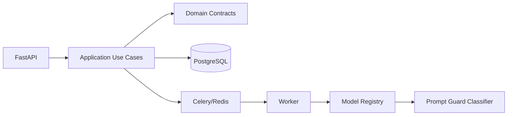

# Final Architecture Report

## 1. Executive Summary

SecurePrompt Guard is a production-shaped backend for paid prompt-safety
classification. The runtime product focuses on one active model,
`prompt_guard`, while retaining a generic internal classifier contract so the
service can evolve without rewriting auth, billing, queues, analytics, or
observability.

The current scope intentionally excludes TextMood Analytics from runtime,
catalog, API examples, and acceptance criteria.

## 2. Runtime Architecture

- API: FastAPI with JWT-protected paid classification endpoints.
- Application: use cases for auth, billing, classifications, analytics, and
  model catalog.
- Domain: users, billing rules, classification entities, and ML contracts.
- Infrastructure: PostgreSQL, Redis, Celery, cache, model plugins, metrics.

## 3. Selected Technologies

- FastAPI for API-first backend and OpenAPI.
- PostgreSQL for transactional billing and request history.
- SQLAlchemy 2.0 async + asyncpg for DB access.
- Alembic for migrations.
- Celery + Redis for async inference and periodic jobs.
- Per-user inference cache for repeated prompts without cross-user leakage.
- Prometheus + Grafana for observability.
- uv for dependency management.
- pytest/Ruff/pre-commit/GitHub Actions for engineering hygiene.

## 4. Active ML Model

Runtime model:

- `prompt_guard`: Rule-Based Prompt Guard Baseline.

Labels:

- `safe`
- `prompt_injection`
- `jailbreak`
- `harmful`
- `data_exfiltration`
- `suspicious`

Production upgrade candidates include Llama Prompt Guard 2 22M/86M, ProtectAI
DeBERTa, DeBERTa-small prompt-injection classifiers, and optional external
moderation adapters for advanced mode.

## 5. Billing Flow

Billing uses `reserve -> inference -> capture/refund`.

- `inference_hold` reserves credits and decreases current balance.
- `inference_capture` is a neutral settlement record with amount `0`; it moves
  reserved credits out of `reserved_balance` without double-counting spend.
- `inference_refund` returns reserved credits after final inference failure.
- `cache_hit_charge` is used only for same-user cache hits.
- Idempotency keys prevent duplicate financial operations.

## 6. Async And Retry Flow

API creates a pending request and enqueues a Celery task. The worker marks the
request as processing, runs inference through `BaseClassifier`, persists the
result, and settles billing. Inference errors are re-raised in the Celery path
so task retries actually execute. After retries are exhausted, the request is
marked failed and reserved credits are refunded.

## 7. Acceptance Scope

The current branch is accepted when:

1. `docker compose up` runs migrations and starts the full stack.
2. `/ready` succeeds only after the database schema exists.
3. `/api/v1/models` exposes `prompt_guard`.
4. Paid async classification, batch processing, billing, analytics, metrics,
   Streamlit, Prometheus, and Grafana work without TextMood runtime support.
5. Unknown `text_mood` requests are rejected because the model is not
   registered.
