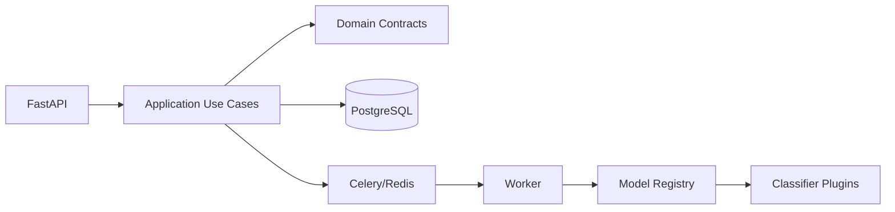

# Final Architecture Report

## 1. Executive Summary

UniClassify Platform is designed as a universal ML classification backend, not a single-model service. The platform core owns users, auth, credits, async requests, history, analytics, monitoring and API contracts. Product ML modules plug in through `BaseClassifier` and `ModelRegistry`.

The MVP starts with deterministic baseline classifiers to make the repository runnable and testable. Production ML upgrades are isolated inside plugin modules.

## 2. Final Architecture

- API: FastAPI.
- Application: use cases for auth, billing, classifications, model catalog.
- Domain: users, billing, classifications and ML contracts.
- Infrastructure: PostgreSQL, Redis, Celery, ML adapters, metrics.

## 3. Selected Technologies

- FastAPI for API-first backend and OpenAPI.
- PostgreSQL for transactional billing and request history.
- SQLAlchemy 2.0 async + asyncpg for DB access.
- Alembic for migrations.
- Celery + Redis for async inference and periodic jobs.
- Redis for cache.
- Prometheus + Grafana for observability.
- uv for dependency management.
- pytest/Ruff/pre-commit/GitHub Actions for engineering hygiene.

## 4. Selected ML Models

MVP:

- Rule-based `PromptGuardClassifier`.
- Rule-based `TextMoodClassifier`.

Production candidates:

- SecurePrompt Guard: Llama Prompt Guard 2 22M/86M, ProtectAI DeBERTa, DeBERTa-small prompt injection classifiers, optional Llama Guard/external moderation for advanced mode.
- TextMood Analytics: DistilBERT/RoBERTa baseline, domain-finetuned encoder classifier, multilingual encoder if Russian/English support is required.

## 5. Dataset Strategy

- Prompt safety: neuralchemy/deepset/HackAPrompt-style prompt injection data, plus safety/toxicity datasets.
- Toxicity: Jigsaw Toxic Comment.
- Sentiment: SST-2 and TweetEval.
- Emotion/anger: GoEmotions and DAIR emotion.
- Urgency: create product-specific support-ticket dataset because public urgency labels are not cleanly standardized.

## 6. Repository Structure

The repository uses clean boundaries:

- `app/domain/ml` for contracts.
- `app/infrastructure/ml/<model_code>` for plugins.
- `app/api/v1` for routers.
- `config/models.yml` for model metadata/pricing.
- `docs` for architecture/research decisions.
- `tests` for deterministic unit and future integration tests.

## 7. Async Flow

API validates model/mode, reserves credits, creates request and enqueues work. Worker loads classifier by `model_code`, runs inference, saves result and captures credits. On failure, worker refunds reserved credits and records failure.

## 8. Billing Flow

Billing uses `reserve -> inference -> capture/refund`.

- Hold is created before enqueue.
- Capture happens only after successful inference.
- Refund happens on inference failure.
- Idempotency keys prevent duplicate financial operations.
- Batch requests reserve total cost and settle per item.

## 9. Model Plugin System

Every classifier implements:

- metadata fields;
- `supported_modes`;
- `labels`;
- `predict(ClassificationInput) -> ClassificationOutput`.

New products are added by creating a plugin folder, adding config and registering the plugin.

## 10. Deployment Approach

Local production-like deployment uses Docker Compose:

- API
- worker
- beat
- PostgreSQL
- Redis
- Prometheus
- Grafana

Production scaling can split API and worker replicas and move model inference to dedicated CPU/GPU nodes.

## 11. Scalability Strategy

- Scale API horizontally.
- Scale workers by model queue.
- Add micro-batching for transformer inference.
- Use cache keyed by model version.
- Move large models to ONNX runtime or dedicated inference service.

## 12. Security Considerations

- Never log raw secrets or authorization headers.
- Hash passwords with a strong password hashing algorithm in Phase 2.
- JWT secrets must come from environment/secret manager.
- Admin endpoints require role checks.
- Billing operations require DB locks and idempotency.
- Prompt safety models are defense-in-depth, not a complete security boundary.

## 13. Observability

Track API latency, request count, worker task status, inference duration, billing operations, label distribution and model version usage. Grafana dashboards should separate platform health from product analytics.

## 14. Testing Strategy

- Unit tests for registry, classifier contracts and billing math.
- API tests with httpx.
- Integration tests with PostgreSQL/Redis for balance locking and Celery boundaries.
- Contract tests for every new model plugin.
- CI runs lint and tests.

## 15. Risks

- Public prompt-injection datasets may not generalize to new attacks.
- Dataset licenses must be checked before redistribution/commercial use.
- Rule baseline is not production-grade ML quality.
- Billing idempotency bugs can cause financial inconsistency.
- Async retries can duplicate effects unless all worker writes are idempotent.

## 16. Future Improvements

- Full auth implementation.
- Alembic migrations for all tables in the technical task.
- Real async classification persistence.
- ONNX model runtime.
- Streamlit dashboard.
- Admin model activation/version controls.
- OpenTelemetry tracing.

## 17. Production Scaling Roadmap

1. Complete DB/auth/billing.
2. Add real queue-backed classification lifecycle.
3. Integrate and evaluate production candidate models.
4. Add model artifact registry and version promotion.
5. Add load tests and worker autoscaling.
6. Split model inference into dedicated services if GPU or memory pressure requires it.
