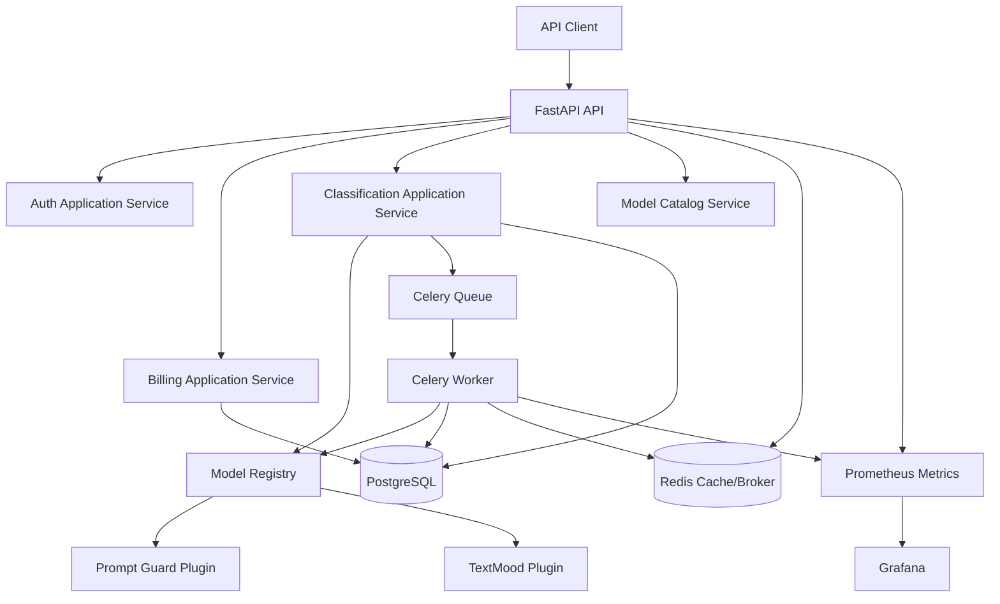
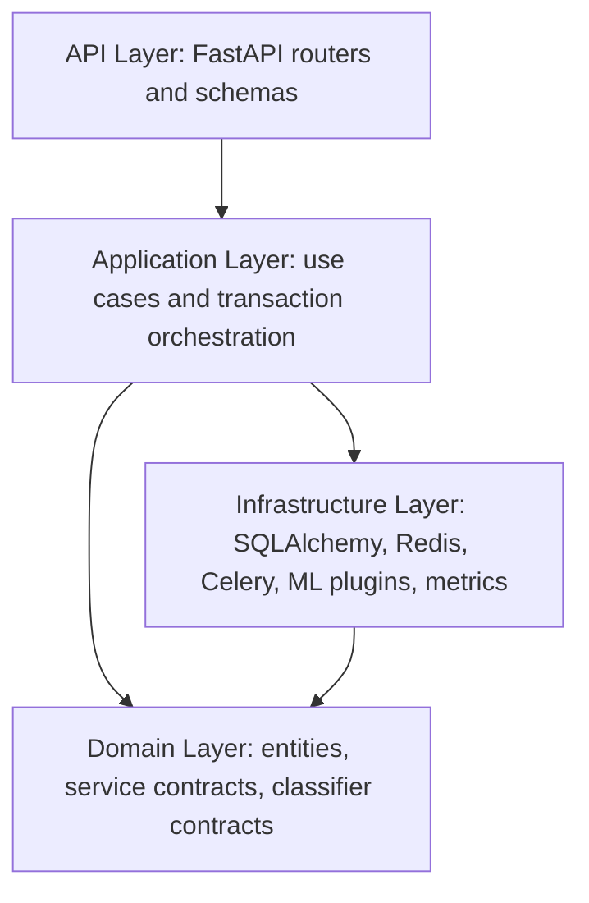
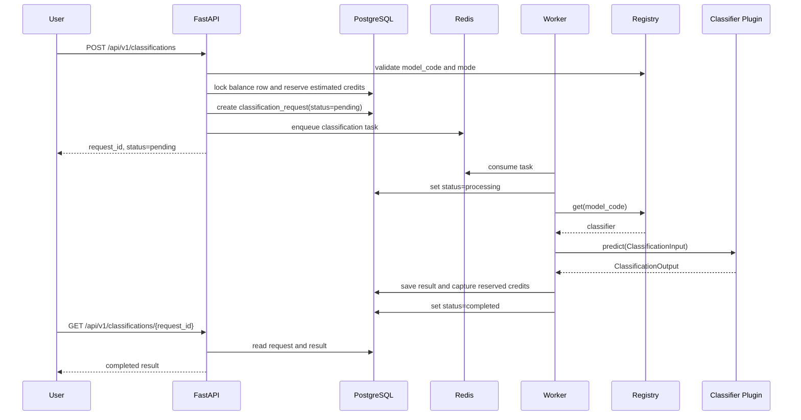
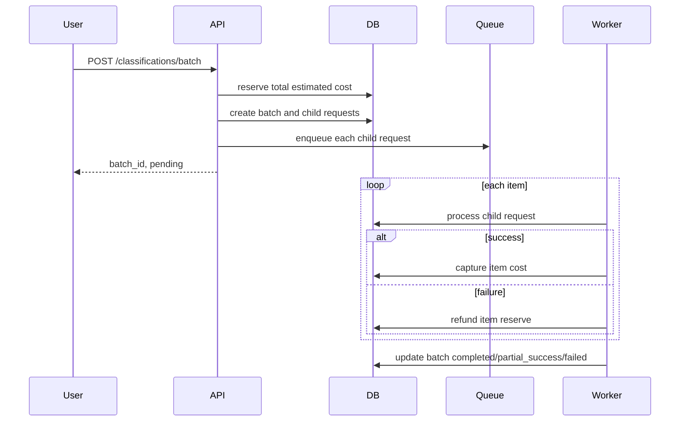
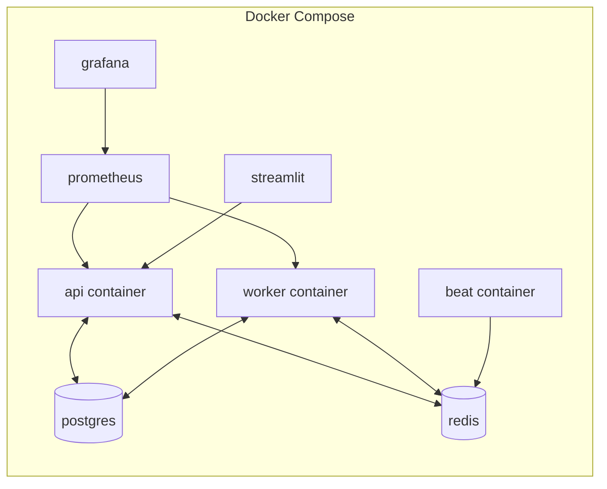

# System Architecture

## Component View

## Layering

## Single Classification Sequence

## Batch Sequence

## Deployment View

## DB Architecture

- PostgreSQL is the source of truth for users, balances, model catalog, requests, results, transactions, promo codes, loyalty tiers and audit logs.
- Redis is not source of truth. It is broker/cache only.
- Balance mutations must lock `user_balances` with `SELECT ... FOR UPDATE`.
- `billing_transactions.idempotency_key` prevents duplicate hold/capture/refund.

## Caching Architecture

- Cache key: `sha256(model_code + mode + normalized_text + model_version)`.
- Cache hit still creates a request/history row and a `cache_hit_charge` transaction.
- Cache is invalidated naturally by model version changes because version is part of the key.

## Model Registry Architecture

- Registry owns model lookup, model metadata and pricing lookup.
- DB stores model catalog for API visibility and admin controls.
- Runtime registry stores instantiated classifier plugins.
- Future production deployment can move heavy models behind HTTP/gRPC inference adapters while keeping `BaseClassifier`.

## Observability

- API metrics: request count, latency, status codes.
- Worker metrics: tasks processed, task failures, inference duration, retry count.
- Billing metrics: holds, captures, refunds, insufficient balance.
- ML metrics: label distribution, confidence distribution, model version usage.
- Logs should include correlation/request IDs, never raw secrets.

